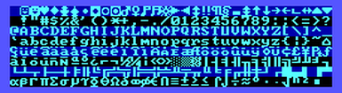
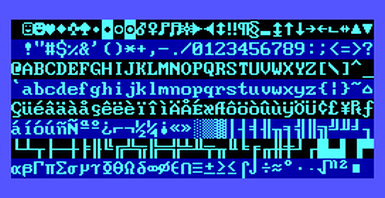
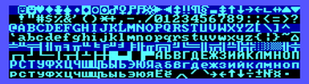
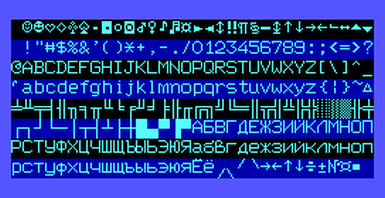
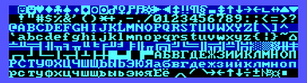
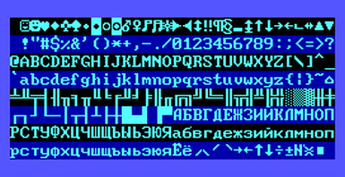
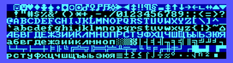
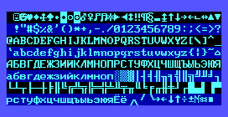
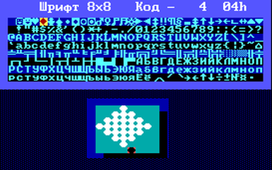

# Советский EGA BIOS
- [Что здесь?](#что-здесь)
- [Результаты сопоставления с IBM EGA BIOS](#результаты-сопоставления-с-ibm-ega-bios)
  - [Отличия в части кода](#отличия-в-части-кода)
  - [Отличия в шрифтах](#отличия-в-шрифтах)
  - [Особенности прошивки 1842](#особенности-прошивки-1842)
- [Сборка](#сборка)
  - [TL;DR](#tldr)
  - [Подробнее](#подробнее)
- [Листинги](#листинги)
  
## Что здесь?

Здесь представлен исходный код EGA BIOS видеоадаптеров ЕС-1842 и ЕС-1849, собранных на микросхемах набора КА1843: ВГ2, ВГ3, ВГ4, ВБ1.   Он является производным от EGA BIOS фирмы IBM  с небольшими изменениями и заменой шрифтов.

Выпуская компьютер PC/AT, фирма IBM в [Technical Reference: Options & Adapters](https://minuszerodegrees.net/oa/oa.htm) опубликовала листинг EGA BIOS (со страницы 108 в [этом файле](https://minuszerodegrees.net/oa/OA%20-%20IBM%20Enhanced%20Graphics%20Adapter.pdf)). В марте 2022 года [Michal Necasek](http://ps-2.kev009.com/michaln/) на своем сайте [OS/2 museum](https://www.os2museum.com/) опубликовал [результат OCR-распознавания этого листинга](https://www.os2museum.com/wp/reconstructing-the-ega-bios/), компилирующийся в почти идентичный IBM EGA BIOS-у в ПЗУ код (за исключением "хвоста" из нулей и последнего байта контрольной суммы). Эта публикация послужила основой настоящей работы. 

Кроме того, как эталонный использовался [файл прошивки](https://minuszerodegrees.net/rom/bin/ibm_6277356_ega_card_u44_27128.bin) IBM EGA BIOS с австралийского cайта [minuszerodegrees.net](https://minuszerodegrees.net/rom/rom.htm). Для сопоставления с остальными у него необходимо инвертировать адреса (первый байт сделать последним, второй - предпоследним и так далее). В дальнейшем эту прошивку буду именовать **IBM**.

Прошивки отечественного EGA для сопоставления были взяты  из файла [romussr.rar](http://poisk-pc.narod.ru/romussr.rar) с сайта [poisk-pc.narod.ru](http://poisk-pc.narod.ru). Установлено, что к EGA BIOS имеют отношение файлы из этого архива, указанные в таблице ниже (для удобства далее прошивки будут кратко именоваться так, как указано в третьей колонке):

|Файлы|Содержание|Условное название|
|--|---------|---|
|1842.ZIP\ЕС1842\4200009.BIN 1842.ZIP\ЕС1842\4200010.BIN|Плата ЕС1842.E024, тонкий шрифт 8x14, основная кодировка |**1842**
|1851.ZIP\ЕС1851\5100040.BIN 1851.ZIP\ЕС1851\5100041.BIN|Плата ЕС-1849.E002 ([раз](https://sun9-20.userapi.com/impg/c858224/v858224926/148954/fgyttCMA7VE.jpg?size=2560x1707&quality=96&proxy=1&sign=401dbbfa21ea0a80e96b6b08ff8008b4&type=album) [два](http://red-innovations.su/index/photos_c/ec/es6.jpg) [три](http://www.leningrad.su/museum/38/ec1849-6.jpg)), применявшаяся в ЕС-1849 и ЕС-1851, похожий на IBM (стандартный) шрифт 8x14, основная кодировка |**ROB**
|1842.ZIP\ЕС1842\42006ROB.BIN|Идентичен файлу 1851.ZIP\ЕС1851\5100040.BIN (см.выше) |**ROB**
|1842.ZIP\ЕС1842\42007ROB.BIN|Идентичен файлу 1851.ZIP\ЕС1851\5100041.BIN (см. выше) |**ROB**
|EGARUS.ZIP\1849.RUS\40RUS.BIN EGARUS.ZIP\1849.RUS\41RUS.BIN|Плата ЕС-1849.E002 ([раз](https://sun9-20.userapi.com/impg/c858224/v858224926/148954/fgyttCMA7VE.jpg?size=2560x1707&quality=96&proxy=1&sign=401dbbfa21ea0a80e96b6b08ff8008b4&type=album) [два](http://red-innovations.su/index/photos_c/ec/es6.jpg) [три](http://www.leningrad.su/museum/38/ec1849-6.jpg)), применявшаяся в ЕС-1849 и ЕС-1851, похожий на IBM (стандартный) шрифт 8x14, кодировка 866|**4041**|

## Результаты сопоставления с IBM EGA BIOS

Отличия в части кода от IBM невелики. В части шрифтов все прошивки отличаются друг от друга.

### Отличия в части кода

Все изменения кода оригинального BIOS, сделанные при создании советского видеоадаптера EGA, сведены в [этот коммит](https://github.com/rcgoff/es1842/commit/e8b9b1a). Изменились три файла - `VPOST.INC`, `V1-5.INC` и `VGRW.INC`.

Ввиду того, что код всех прошивок близок к **IBM**, в исходные файлы было введено условное ассемблирование.  Если определена только переменная  RUS_EGA,  генерируется код версии **1842**. Если же определена еще и переменная ROB, генерируется код версии **ROB**. Если обе переменные не определены, генерируется код **IBM**.

Скорее всего, прошивка **1842** - первоначальная версия, а прошивка **ROB** - следующая. Кодовая часть прошивок **ROB** и **4041** идентична.  Рассмотрим сначала отличия прошивки **1842**.

-  В файле `VPOST.INC` в ходе теста по включению питания в прошивке **1842** не фиксируется ошибка, если количество активаций сигнала VIDEO ENABLE не равно числу строк изображения. Возможно, это связано со схемотехникой платы отечественного EGA или неполной совместимостью БИС. Изменение проведено по исходному тексту - условный переход заменен безусловным, причем не той длины (используемый ассемблер не определил, что переход вперед - короткий, и поставил лишний NOP). Из-за этого увеличения длины команды на один байт изменились смещения в командах переходов, и при двоичном сравнении дамп прошивки выглядит сильно отличающимся от **IBM**.
- В том же файле `VPOST.INC` в ходе теста по включению питания один из тестов в прошивке **IBM** предусматривает вывод в видеобуфер строки символов с кодом 0DBh - сплошной закрашенный прямоугольник. В прошивке **1842** используется основная кодировка, в которой аналогичный символ имеет код 0ABh и, соответственно, проведена замена.

- В файле `V1-5.INC` отличается реализация функции 01h прерывания INT 10h (установка формы курсора). **IBM** BIOS выполняет инкремент регистра CL (*конечная* строка курсора) перед записью в контроллер ЭЛТ. Это связано с тем, что в EGA адаптере, в отличие от CGA/MDA, значение, засылаемое  в регистр *начальной* строки курсора контроллера, должно быть на единицу меньше реального номера начальной строки курсора (см. описание Cursor Start Register на стр. 36-37 в [техописании IBM EGA](https://minuszerodegrees.net/oa/OA%20-%20IBM%20Enhanced%20Graphics%20Adapter.pdf)). Вместо декремента CH, отвечающего за *начальную* строку, делается инкремент *конечной*. Тем самым информация о высоте курсора сохраняется и, полагаю, уходят проблемы декремента нулевого значения. Но сам курсор оказывается сдвинут на одну позицию вниз.   В прошивке **1842** инкремент CL в функции 01h не производится. Возможно, это связано с неполной совместимостью контроллера ЭЛТ КА1843ВГ2 со стандартом EGA. Изменение проведено как патч - вместо инкрементов расставлены NOP-ы с сохранением длины команд.

Отличия прошивки **ROB** от **1842** незначительны:

 - В файле `VPOST.INC`  упоминание о копирайте фирмы IBM заменено на NII EWM, также заменена дата на 12/01/1990.
 - Произошло изменение версии используемого минчанами ассемблера, в связи с чем в файле `VGRW.INC` выражение `AND	DI,030H` стало транслироваться не в четырех-, а в трехбайтную команду. Соответственно изменились смещения в командах переходов, и при двоичном сравнении дамп прошивки выглядит сильно отличающимся от **IBM** и **1842**.

Интересно, что в прошивке **4041**, несмотря на то, что используется кодировка 866, не проведена обратная замена символа 0ABh на 0DBh в `VPOST.INC`, то есть код полностью идентичен прошивке **ROB**.

### Отличия в шрифтах

В видеоадаптере MDA фирма IBM использовала шрифт 9x14, а в режимах высокого разрешения EGA использован шрифт 8x14. IBM EGA предусматривает подключение монохромного MDA дисплея. Специально для этого случая в прошивке **IBM** предусмотрена таблица с измененными кодами символов шрифта 8x14, чтобы они комфортнее отображались на MDA дисплее с матрицей 9x14. Таблица хранится в файле `VCGMNFDG.ASM`. В прошивках отечественных EGA эта таблица [не заполнена](https://github.com/rcgoff/es1842/commit/089afa4). Код BIOS интерпретирует нули как конец таблицы, так что изменений в нем не потребовалось.

Как уже отмечалось, экранные шрифты всех исследованных прошивок различны. Приведу их изображения, сгенерированные программой [FONTEDIT](http://old-dos.ru/files/file_1926.html) [Александра Гутникова](https://www.kv.by/content/320115-slovo-i-delo-20-let-spustya).

|Прошивка|Шрифт 8x8|Шрифт 8x14|
|--|---------|---|
|**IBM**||
|**1842**| |
|**ROB**||
|**4041**|||

Для того, чтобы можно было удобно смотреть, чем шрифты отличаются друг от друга, добавление каждого из них сделано отдельным коммитом. Опишу особенности шрифтов.

В прошивке **1842** шрифт 8x14 - с тонкими линиями, напоминающими шрифты ОС Альфа-ДОС для монохромного дисплея ЕС-1840/41, а шрифт 8x8 полностью идентичен шрифту из BIOS ЕС-1841.

В прошивке **ROB** в шрифте 8x14 символы с кодами 0-7Fh идентичны шрифту IBM, а в шрифте 8x8 [есть различия](https://github.com/rcgoff/es1842/commit/b231bdf#diff-18f8d50e8e444ae43aa307f9c5c0e69014daa642d7dea27e7c9f6d0223c7bf75) как в некоторых символах с кодами 0-7Fh (в сравнении с **IBM**), так и в большом количестве символов с кодами 80h-0FFh (в сравнении с **1842**).

В прошивке **4041**  в шрифте 8x14 у символов с кодами 0-7Fh имеются различия [как с **ROB**](https://github.com/rcgoff/es1842/commit/95ea5e5#diff-22e376f86896771b8239b00f372ac759e6439e7d9a1e432a7831189c80caed40), так и с **IBM**, а у шрифта 8x8 символы с кодами 0-7Fh [идентичны](https://github.com/rcgoff/es1842/commit/95ea5e5#diff-e96e3d02cf508cda3dc31d6a80ce20a83e5211a30aa0c9d5a93ad07d5d834b8a) шрифту **IBM**.

ASM-файлы шрифтов (за исключением шрифта 8x8 прошивки **1842**) восстанавливались из дампов прошивок. Для облегчения конвертации формата дампа (16 байт в строке) в форматы шрифтовых ASM-файлов, принятых в исходном тексте **IBM**, были составлены [две Excel-таблицы](./supplement) для 8x8 и 8x14 шрифтов соответственно. На первый лист таблиц копировался дамп из HEX-редактора, из последнего листа забиралась заготовка для ASM-файла.

### Особенности прошивки 1842

В отличие от всех остальных прошивок, со смещения `3960h` содержащих нули до конца файла, прошивка **1842** далее до смещения `3С4Fh` содержит некий код, а со смещения `3C50h` до конца файла - повтор данных, содержащихся в начале файла (со смещения `0`). 

Было проведено [формальное дизассемблирование](https://github.com/rcgoff/es1842/commit/e843bd8) кода в интервале смещений `3960h - 3C4Fh`. Оказалось, что это мусорный код (на него нет ссылок в коде BIOS, а сам он содержит переходы на шрифтовую часть кода). Судя по тому, что в нем содержатся переходы в область пользовательского ОЗУ (сегменты `2087h`, `20C8h` и т.д.) - это часть оперативной памяти при работе некоей программы. По особенностям кода видно, что это результат работы компилятора с языка высокого уровня, а не написанная на ассемблере программа. Файлы, относящиеся к этому мусорному участку кода - [`JUNKCODE.ASM`](./source/JUNKCODE.ASM), [`JUNKDATA.INC`](./source/JUNKDATA.INC), [`JUNKSEG.INC`](./source/JUNKSEG.INC).

Прошивка **1842** содержит две ошибки считывания из ПЗУ. Одна из них повредила символ с кодом 04h в шрифте 8x8 (точки внизу символа явно не должно быть):

Технически ошибка выглядит так: по смещению `3187h` вместо `00h` записано `08h`.

Вторая ошибка находится в повторе начала, в самом конце файла прошивки. По смещению `3D5Fh` вместо `C0h` записано `C8h`. 

Обе ошибки не отражены в исходном тексте в этом репозитории, а вносятся (для полного двоичного соответствия с оригинальным файлом прошивки) на этапе сборки [в этом скрипте](./source/exe2bin2.bat).

Прошивка **1842** не содержит байта контрольной суммы. Возможно, в BIOS ЕС-1842 она не проверяется.

 
## Сборка

### TL;DR
 Сборка тестировалась на Windows 7 32-bit. Для неё требуются:
 - Утилиты EXE2BIN и DEBUG (входят в поставку Win7 32-bit);
 - 16-разрядный линкер Misrosoft LINK16.EXE;
 - [Borland Turbo Assember 5.0](https://winworldpc.com/product/turbo-assembler/5x).
 
 Сборка:  `make`  
 Очистка проекта: `make clean` 

В результате сборки генерируется 4 файла прошивок:
 - `EGA-IBM.BIN`
 - `EGA-1842.BIN`
 - `EGA-ROB.BIN`
 - `EGA-4041.BIN`

Все они полностью совпадают с исходными.
 
### Подробнее
[makefile](./source/makefile) в настоящем репозитории составлен для [Borland Turbo Assembler 5.0](https://winworldpc.com/product/turbo-assembler/5x). К сожалению, TLINK из его комплекта поставки не обрабатывает объектные файлы без точки входа, поэтому необходим также 16-разрядный линкер от Microsoft. Он входит в пакет [MASM32](http://www.masm32.com/download.htm), также см., например, [здесь](https://wasm.in/threads/sobrat-16-bitnyj-ispolnjaemyj-fajl-na-windows-10-64-bits.33925/). Возможно использование ассемблера и линкера (но не MAKE!) из [Microsoft MASM 5.0](https://winworldpc.com/product/macro-assembler/5x) (в makefile при этом следует изменить переменные `assembler=` и `linker=`). Более ранние версии ассеблера MASM не годятся. Более ранние версии линкера - наоборот, годятся (проверил до 3.0). Вместо MAKE из Borland Turbo Assembler возможно использование NMAKE из Microsoft Visual Studio, даже свежих версий. 

Для окончательного преобразования файлов после линкера использованы утилиты MS-DOS: EXE2BIN и DEBUG, включенные в поставку Windows до версии 7 32-bit, поэтому сборку из-под более современных версий Windows можно провести только в эмуляторе DOS.

Почти вся работа по обращению к DEBUG (формирование скрипта для него и запуск) сведена в файл [`exe2bin2.bat`](./source/exe2bin2.bat). В этом же файле в образы прошивок записываются контрольные суммы, а в прошивку **1842** вносятся "ошибки".  В формировании мусорного кода для прошивки **1842** также участвует скрипт для DEBUG, генерируемый файлом [`mkjunk.bat`](./source/mkjunk.bat).

makefile поддерживает опцию `clean`. 

## Листинги
Для удобства анализа кода в репозиторий [включены листинги](https://github.com/rcgoff/es1842/commit/c694049), сгенерированные MASM 5.0 (на мой вкус, формат листингов TASM менее приятен). Листинги обработаны моей неказистой утилитой [LST2ASM](https://github.com/rcgoff/es184x-bios/blob/main/lst2asm/lst2asm.vb), написанной для встроенного в MS Excel Visual Basic for applications. Эта утилита убирает разбивку листинга на страницы и некоторые пустые строки, излишне генерируемые ассемблером.